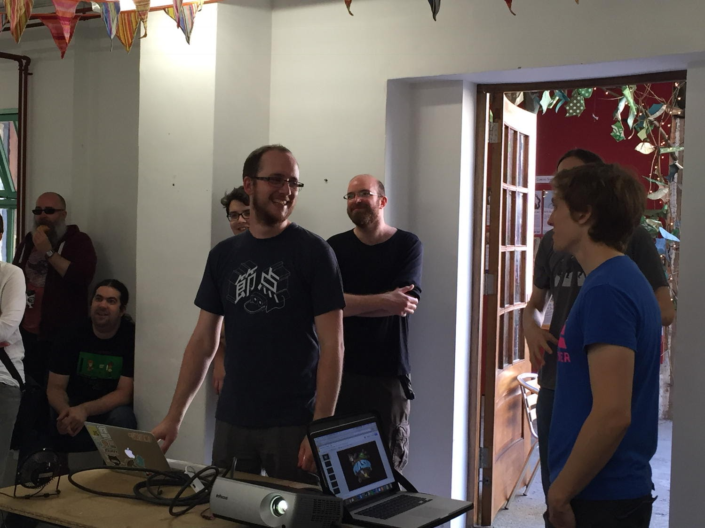
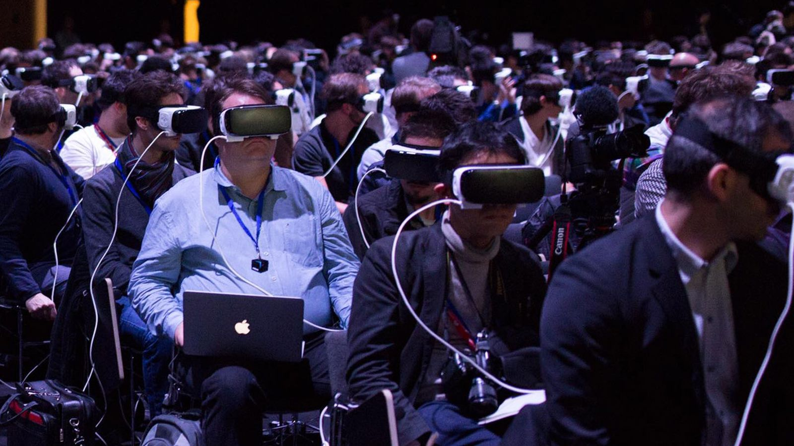
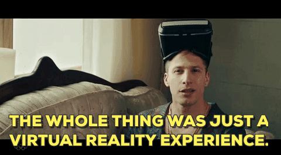

# <!-- fit --> Hello!

---

## <!-- fit --> The UX of VR _10 Quick tips_

Max Glenister / @omgmog

---

### _Previously..._
# <!-- fit --> Did some talks about VR/JavaScript
# <!-- fit --> Co-hosted VR/Game dev Hackday
# <!-- fit --> Spent a month making VR stuff each day
### Created uxofvr.com

<!-- ^ I've been dabbling with VR stuff since 2015.  I've done a couple of talks here about using JavaScript to make VR experiences,  I co-hosted the game dev hackday at the last summer of hacks,  I made stuff for Google Cardboard every day in October last year, and I created the hugely popular resource uxofvr.com.  In doing all of this I've learned a lot, so today I thought I'd share a couple of points with you all. -->

---

## 1.

# <!-- fit --> _Try things out   on others ASAP_

<!-- ^ Everybody experiences VR differently, so what works or seems fine to you might be really weird for somebody else.  Scale, height, interpupillary distance, handedness and even accessibility differences can have unintended or negative effects on your experience.-->

---

## 2.
# <!-- fit --> _Prototypes don't  need to be perfect_

<!-- ^ Just get an idea thrown together and get testing it.  Iterating prototypes is cheap. Testing on real users is valuable.  Your first idea won't be your best.  The sooner you can get your idea on to an actual headset, and on to the heads of actual users the better. -->

---

## 3.
# <!-- fit --> _Not everything  is better in VR_

<!-- ^ It might have been better to title this "Not everything works in VR". VR is the new shiny. It might be tempting to port an existing game or experience over to VR, but you'll encounter a lot of interaction problems.  It's better to work from the ground up with a new concept. If you're making things in VR, you're probably aware that you're working at the bleeding edge, so try and keep it fresh! -->

---

## 4.
# <!-- fit --> _Make sure the user's eyes and ears agree_

<!-- ^ ...Or they might puke.  If your eyes see that you're moving around, but your inner ear, or vestibular system aren't sensing that, then your body might try to compensate and you'll feel like you're about to fall over. I read on IGN that taking ginger supplements can help combat VR motion sickness... I can't prove or disprove that as this doesn't effect me -->

---

## 5.
# <!-- fit --> _Don't make the user  move awkwardly_

<!-- ^ You might think you've got an infinite amount of space to play with -- and you do! But you should use it responsibly.  Most first-time roomscale VR users don't realise thay can walk around, so don't put things just out of reach.  Overstretching to hit a button or target will most likely end up with a broken TV with a controller-shaped dent in the screen, or people with bloodied noses. -->

---

## 6.
# <!-- fit --> _Don't make UI that  requires the user to  turn their head a lot_

<!-- ^ You've got 360 degrees of places to put your UI, but you should really use the 110 degrees in front of the user for important interfaces. If you really want to put something behind the user, make it an exploratory feature rather than something important. -->

---

## 7.
# <!-- fit --> _Keep text at a readable size_

<!-- ^ The quality of the displays in VR headsets can vary from device to device.  Even on the HTC Vive and Oculus Rift small text can be hard to read.  Avoid having walls of text. -->

---

## 8.
# <!-- fit --> _Be forgiving  of mistakes_

<!-- ^ It's not fun to play a restrictive VR Game, so let the user throw things around and break things.  VR isn't restricted by the same rules as real life.  If they break or lose a key item you can always respawn it somewhere convenient. -->

---

## 9.
# <!-- fit --> _Watch & Learn  from others_

<!-- ^ There are a lot of smart people out there working things out in VR, and thankfully many of them like to speak about what they've done. If this wave of VR is going to take off, we can't all work in our own little towers... -->

---

## 10.
# <!-- fit --> _Give back to  the community_

<!-- ^ If you think you've learned something during the process, others will probably be able to learn from it too.  Share what you're doing. Share your data. Share your methods. -->

---

## *11.*
# <!-- fit --> You can change  things as you go

---

# www.UXofVR.com

<!-- ^ So I made this, I've mentioned it a couple of times here at JS Oxford.  It contains lots of videos, articles and resources to help you improve the UX of your VR projects.  If visited the site before, you should check it out again.  I recently added a new feature that lets you keep track of which resources you've viewed. -->

---

## 👇 _Oxford's Virtual Reality Crowd Meetup_

<!-- ^ Oxford's Virtual Reality Crowd - we're having our third meetup tomorrow.  You can talk about VR, show off any VR projects you're working on and network with other fans of VR.  Come along, it's in the real world not the virtual one, at Brookes University Headington Hill Hall from 6pm to 8pm. Find out more on meetup.com -->

---

## _Thanks!_

## <!-- fit -->@omgmog / omgmog.net / uxofvr.com
